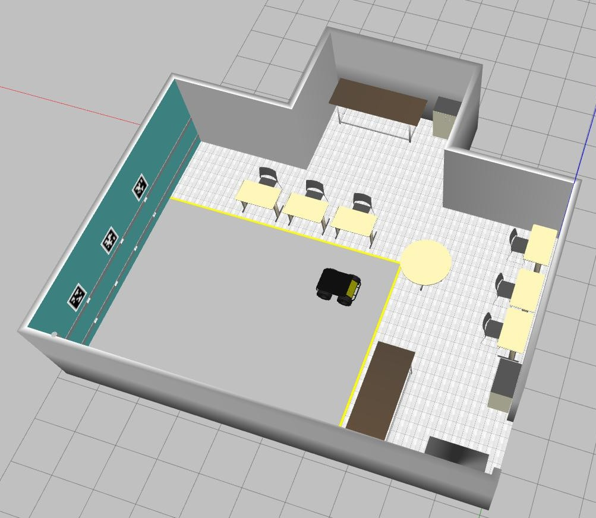

# LaR Gazebo

Repository containing the simulated environment of the Robotics Laboratory (*LaR*) at UFBA and the robot Husky from ClearPath to be used with [Gazebo].



This package has been tested under ROS Noetic on Ubuntu 20.04 with Gazebo 11.11. The LaR Gazebo is a research repository that may change often, and any fitness for a particular purpose is disclaimed.

## Table of contents

- [Installation](#installation)
- [Building](#building)
- [Usage](#usage)
  - [Empty World](#empty-world)
  - [Husky Robot](#husky-robot)
    - [Husky Accessories](#husky-accessories)
  - [Hector SLAM](#hector-slam)
  - [Disable shadows](#disable-shadows)
  - [Editing the lar.world](#editing-the-larworld)
- [April Tags](#april-tags)
- [Contributing](#contributing)
- [License](#license)

## Installation

If you do not have yet a [catkin workspace] configured, please, configure it first. Follow the instructions in the tutorial [Creating a workspace for catkin](http://wiki.ros.org/catkin/Tutorials/create_a_workspace).

> **ATTENTION:** All the proposed commands in the remainder of this README assume you create the workspace with the name "catkin_ws" in your home folder. Change the commands accordingly if you used another directory and/or name.

After configuring the workspace, clone this repository into the source folder:

```
cd ~/catkin_ws/src
git clone https://github.com/lar-deeufba/lar_gazebo/tree/noetic
```

After that, install the dependencies of this package by running the following command in the root of your workspace:

```
cd ~/catkin_ws
rosdep init
rosdep update
rosdep install --from-paths src/lar_gazebo --ignore-src -r -y --rosdistro noetic
```

## Building

There are two Command Line (CLI) tools to build packages in ROS1: catkin (default) and [catkin tools]. For beginners, we strongly recommend using the catkin tools because it is more user-friendly than catkin.

> Old ROS1 users who know catkin, feel free to use it!

To install [catkin tools], see the instructions in [its tutorial](https://catkin-tools.readthedocs.io/en/latest/installing.html#installing-on-ubuntu-with-apt-get). Once installed, run the commands below to build the LaR Gazebo package.

```
cd ~/catkin_ws
catkin build
```

After the package building, source your workspace's `setup.bash` to have the LaR Gazebo package available to use the ROS commands described in the next section.

```
source ~/catkin_ws/devel/setup.bash
```

If you do not want to run the command every time, put it in your `~/.bashrc`:

```
echo "source ~/catkin_ws/devel/setup.bash" >> ~/.bashrc
```

## Usage

There are three launches file in this repository:

1. a launch file to spawn an empty world (empty laboratory)
2. a launch file to spawn the Husky robot inside the laboratory (which may launch together the `hector_slam`)
3. a launch file to run the [hector_slam] package alone

The sections below show how to use each of them.

### Empty World

Use the command below in your terminal to launch the LaR empty

```
roslaunch lar_gazebo lar_world.launch
```

### Husky Robot

To spawn Husky inside the laboratory, run:

```
roslaunch lar_gazebo lar_husky.launch
```

You can also launch the [hector_slam] package with the Husky robot. To do that, you must enable the laser scanner assembled on the robot running the commands:

```
cd ~/catkin_ws/src/lar_gazebo
source husky_accessories.sh
```

Then, run:

```
roslaunch lar_gazebo lar_husky.launch hector_slam:=true
```

#### Husky Accessories

The robotics community around the world uses the husky robot a lot as a platform to carry out academic research and adapt the robot to develop specific tasks. Due to that, the Husky developers provide a flexible way to add new devices and sensors to the robot. To configure the robot, you must set the Environments Variables described in the [online documentation](http://www.clearpathrobotics.com/assets/guides/kinetic/husky/CustomizeHuskyConfig.html#environment-variables). To ease the task to do that; this package has the [husky_acessories.sh](husky_accessories.sh) file in which you must only uncomment the specific configuration line, change it, and thus source the file again by running the commands below to have the device working.

```
cd ~/catkin_ws/src/lar_gazebo
source husky_accessories.sh
```

The lines uncommented by default enable the laser scanner 2D Stick LMS1XX series and the Realsense RGBD sensor. Also, it was inserted the plugin [P3D](https://classic.gazebosim.org/tutorials?tut=ros_gzplugins#P3D(3DPositionInterfaceforGroundTruth)) plugin to provide in the topic `gazebo_ground_truth/odom` the ground truth of the robot's pose inside the Gazebo world.

### Hector SLAM

The `hector_slam` package is not intended to run alone. However, if you want to analyze some laser scanner data from a bag, you can launch the `hector_slam` process by executing the command below:

```
roslaunch lar_gazebo hector_slam.launch
```

### Disable shadows

If you open Gazebo using the launchers, it opens automatically with shadows disabled.

Otherwise, you have to disable it directly on Gazebo GUI:

1. With Gazebo opened, go to the left panel and locate *Scene*  in the world tab;
2. Click on the *Scene*;
3. Now search for *shadows*;
4. And finally, uncheck the square right after *shadows*;

> **NOTE:** If you've getting lost visit the [tutorial](http://gazebosim.org/tutorials?cat=guided_b&tut=guided_b2) of *Gazebo GUI* (Graphical User Interface).

### Editing the [lar.world](worlds/lar.world)

When we launch the simulation, the integration between Gazebo and ROS points out the correct path to the folder that stores the models used in the `.world` file. However, when you spawn the world without ROS by running

```
cd  ~/catkin_ws/src/lar_gazebo
gazebo worlds/lar.world
```

you must inform the Gazebo system where find the models used in the simulation to open the world without ROS. Therefore, execute the following command on the terminal used to open Gazebo (without ROS):

```
export GAZEBO_MODEL_PATH=$(rospack find lar_gazebo)'/models'
```

> **Note:** You must have installed and configured before the lar_gazebo package for the command `rospack find lar_gazebo` to work properly,

If you do not want to run the export command every time, put it in your `~/.bashrc`:

```
echo 'export GAZEBO_MODEL_PATH=$(rospack find lar_gazebo)/models' >> ~/.bashrc
```

## April Tags

The [AprilTags images](april_tags) were retrieved from the repository [apriltag-imgs]. Then, the [gazebo_models] generates the Gazebo models. It is worth highlighting that the size of the original images is 9 x 9 pixels. The [gazebo_models] waits for images with 170 x 170 pixels. Therefore, it is necessary to resize the images to 170 x 170 pixels using the command recommended in [apriltag-imgs]:

```
convert <small_marker>.png -scale 170 <big_marker>.png
```

## Contributing

Pull requests are welcome. For significant changes, please open an issue to discuss what you would like to change.

Please make sure to update tests as appropriate.

## License

[BSD](https://opensource.org/licenses/BSD-2-Clause)

[apriltag-imgs]: https://github.com/AprilRobotics/apriltag-imgs/tree/master/tag36h11
[gazebo_models]: https://github.com/mikaelarguedas/gazebo_models
[Gazebo]: http://gazebosim.org/
[Husky]: http://wiki.ros.org/Robots/Husky
[catkin workspace]: http://wiki.ros.org/catkin/workspaces
[hector_slam]: http://wiki.ros.org/hector_slam
[catkin tools]: https://catkin-tools.readthedocs.io/en/latest/
